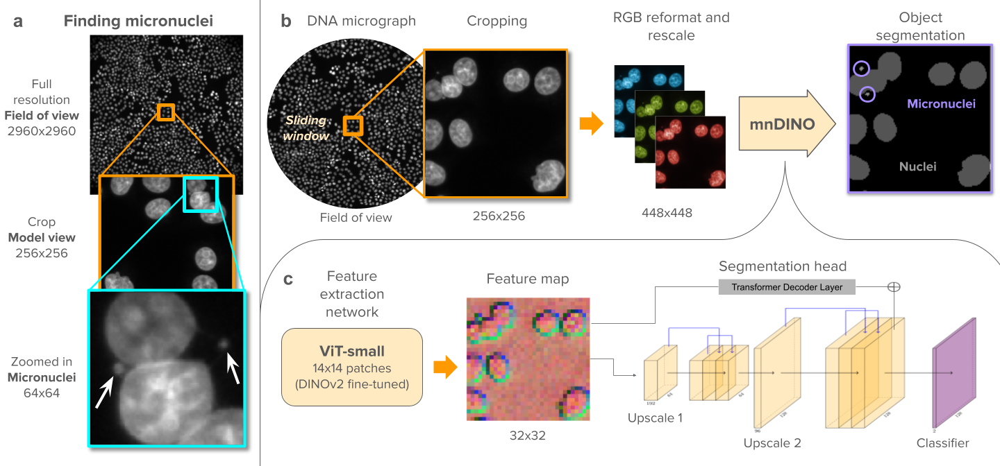

# mnDINO: Accurate and robust segmentation of micronuclei with vision transformer networks

[](https://lbesson.mit-license.org/)
[](https://www.python.org/downloads/release/python-312/)
[](https://pytorch.org/get-started/previous-versions/#v25)

This repo provides the PyTorch source code of our paper: [mnDINO: Accurate and robust segmentation of micronuclei with vision transformer networks](). The pre-trained model is publicly available on [huggingface](https://huggingface.co/CaicedoLab/mnDINO), and the dataset can be downloaded through [Bioimage Archive](https://www.ebi.ac.uk/biostudies/bioimages/studies/S-BIAD2809).

The mnDINO model is specifically designed for highly efficient and accurate micronuclei segmentation in DNA-stained images across diverse experimental conditions. The model outputs both micronuclei and nuclei segmentation masks simultaneously. To accelerate future research in micronucleus (MN) biology. The dataset, code, and pre-trained model are made publicly available to facilitate future research in micronucleus (MN) biology.



# Usage

Refer to [tutorial notebook](tutorials/) for example usage of mnDINO model

### Install Package
```bash
pip install mndino
```

### Load the model
```python
import torch
from mndino import mnmodel
from huggingface_hub import hf_hub_download

model_path = hf_hub_download(repo_id="CaicedoLab/mnDINO", filename="mnDINO_v1.pth")
device = "cuda" if torch.cuda.is_available() else "cpu"
model = mnmodel.MicronucleiModel(device=device)
model.load(model_path)
```

### Make predictions
```python
import skimage
import numpy as np

STEP = 32 # recommended value
PREDICTION_BATCH = 4
THRESHOLD = 0.5

im = skimage.io.imread(your_image_path)
im = np.array((im - np.min(im))/(np.max(im) - np.min(im)), dtype="float32") # normalize image
probabilities = model.predict(im, stride=1, step=STEP, batch_size=PREDICTION_BATCH)

mn_predictions = probabilities[0,:,:] > THRESHOLD
nuclei_predictions = probabilities[1,:,:] > THRESHOLD
```

### Evaluation
```python
import skimage
from mndino import evaluation

mn_gt = skimage.io.imread(your_annotated_image_path)
precision, recall = evaluation.segmentation_report(predictions=mn_predictions, gt=mn_gt, intersection_ratio=0.1, wandb_mode=False)
```

# Reproducing mnDINO Experiments
Environment files for reproducing experiments in the manuscript is under [environments](environments/) folder.

Train mnDINO
```python
python3 training_model.py --path '/scr/data/annotated_mn_datasets/' --gpu 0 --epochs 20 --batch_size 4 --loss_fn 'combined' --lr 1e-5 --scale 1.0 --gaussian
```

Making predictions on test set
```python
python3 prediction.py --path '/scr/data/annotated_mn_datasets/' --test_set  --gpu 0 --step 32 --batch_size 4 --prob_threshold 0.5 --iou_threshold 0.1 --scale 1
```

Turn on `--test_set` if user wants to evaluate on test set, turn it off to select validation set. <br>
Turn on `--wandb_mode` if user wants to show loss on Weights and Biases

# Reproducing Baseline Experiments
MNFinder Evaluation
```python
python3 mnfinder_prediction.py --test_path '/scr/data/annotated_mn_datasets/test/images/' --save_path '/scr/data/annotated_mn_datasets/mnfinder_predictions/' --wandb_mode
```

Cellpose Finetuned Evaluation
```python
python3 cellpose_prediction.py --gpu 0 --train_path '/scr/data/annotated_mn_datasets/train/images/' --save_path '/scr/data/annotated_mn_datasets/cellpose_predictions/' --finetune --wandb_mode
```

Frozen microSAM backbone (better performance)
```python
python3 microsam_prediction.py --gpu 0 --train_path '/scr/data/microsam_data/train/' --pred_path '/scr/data/annotated_mn_datasets/test/images/' --save_path '/scr/yren/microsam_data/microsam_predictions/' --frozen --wandb_mode
```

Retrain microSAM
```python
python3 reformat_microsam_images.py --load_path '/scr/yren/annotated_mn_datasets/' --save_path '/scr/yren/microsam_data/'

python3 microsam_prediction.py --gpu 0 --train_path '/scr/data/microsam_data/train/' --pred_path '/scr/data/annotated_mn_datasets/test/images/' --save_path '/scr/yren/microsam_data/microsam_predictions/' --wandb_mode
```

Turn on `--frozen` if user wants to use frozen microSAM backbone to make predictions


# Train your own specialist model
- Expected file extension of training images and nuclei masks is `.tif`, the corresponding training masks is `.png`. Following values are tunable if retraining on non-micronucleus subcellular datasets.
- Combined loss = 0.8 * subcellular loss + 0.2 * nuclei loss.

```python
device = f"cuda:{gpu}" if torch.cuda.is_available() else 'cpu'
model = mnmodel.MicronucleiModel(
    device=device,
    data_dir=DIRECTORY,
    patch_size=256,
    scale_factor=1.0,
    gaussian=True,
    oversample=False # oversample option is only applied to the micronuclei dataset presented in manuscript
)

model.train(epochs=20, 
            batch_size=4, 
            learning_rate=1e-5, 
            loss_fn='combined',
            weight_decay=1e-6,
            wandb_mode=False
)

model.save(outdir=OUTPUT_DIR, model_name=MODEL_NAME)
```